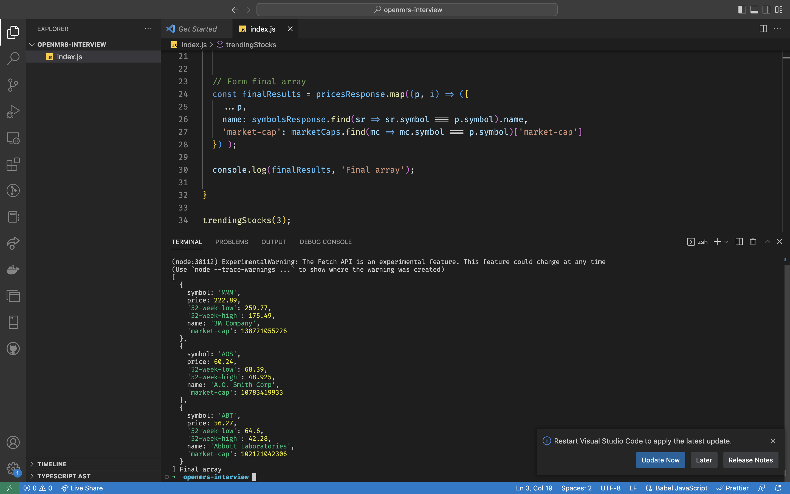

# US-based stocks by market cap.

- Create an asynchronous function called  trendingStocks  that accepts an integer 'n' as an input. The function should return an array of 'n' objects, each object representing the top 'n' US-based stocks by market cap. 
Each object should have the following 6 properties: "name", "symbol", "price", "market-cap", "52-week-high", and "52-week-low". The objects should include the data of the top 'n' US-based stocks by market cap.

## Screenshot of logs sample
- 

## Question doc link
- https://docs.google.com/document/d/1snP6X8lP3j0323IeRx3VPp0uCR0Vkl4lUsno6zii7Dc/edit?usp=sharing

